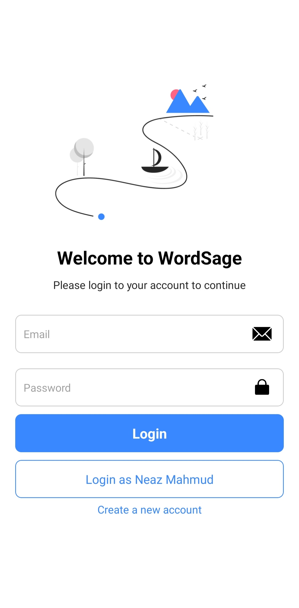
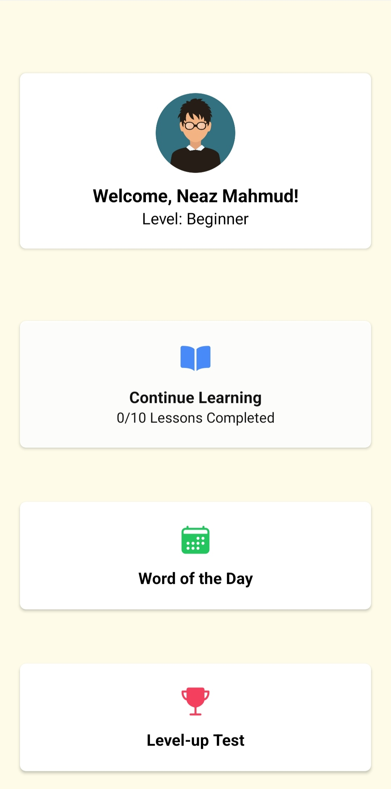
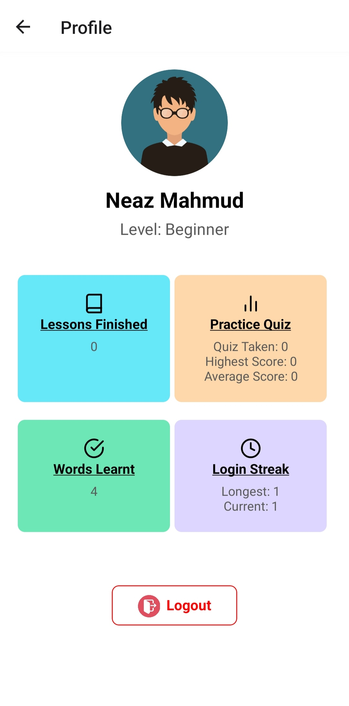
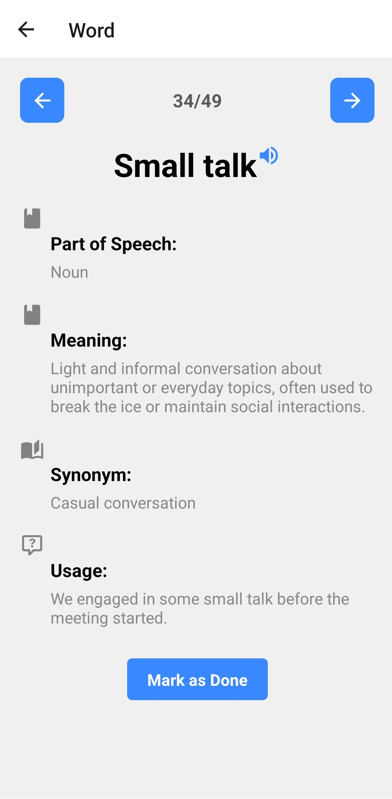
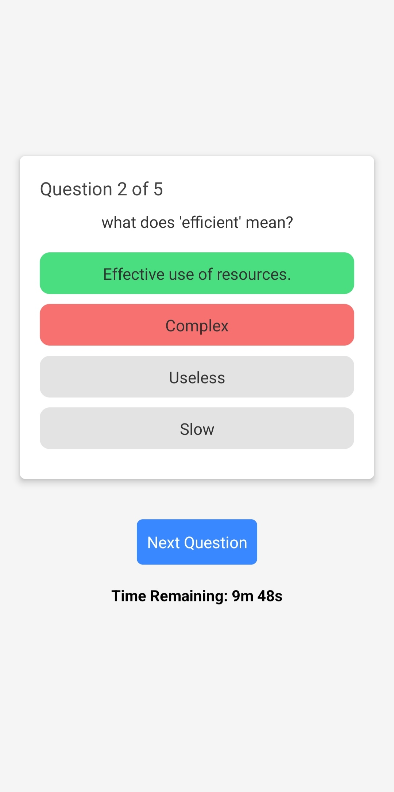
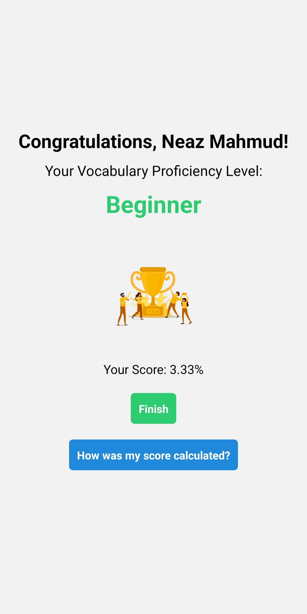
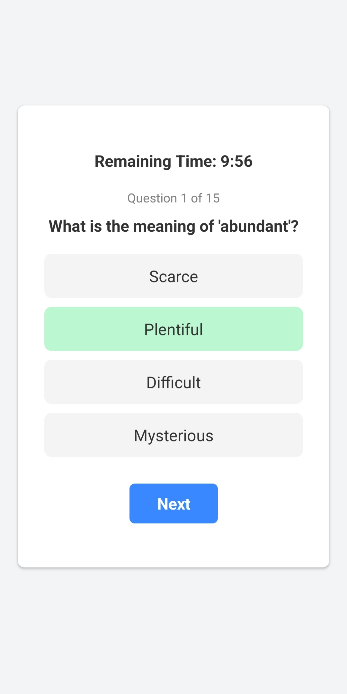
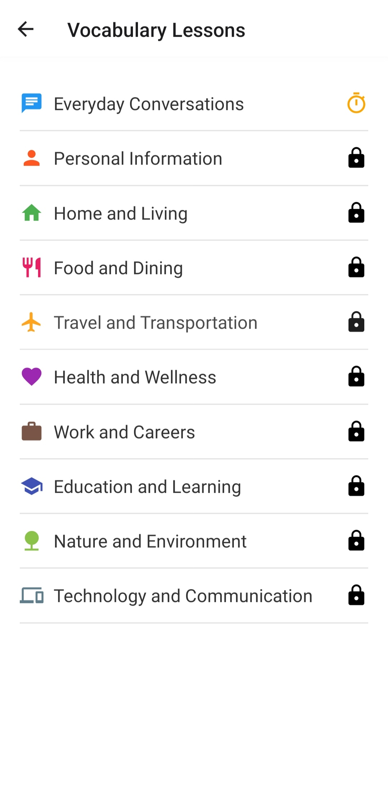
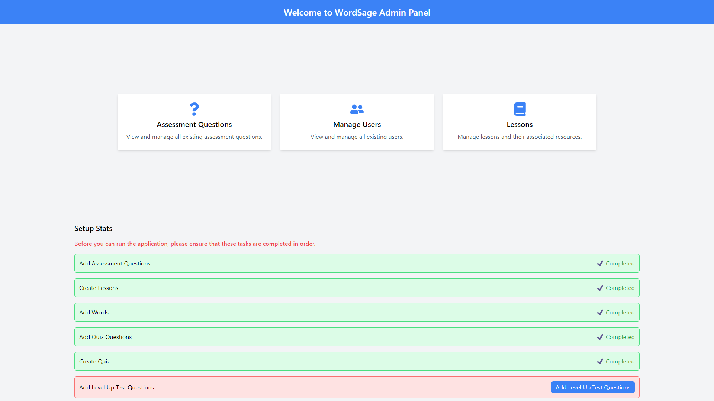
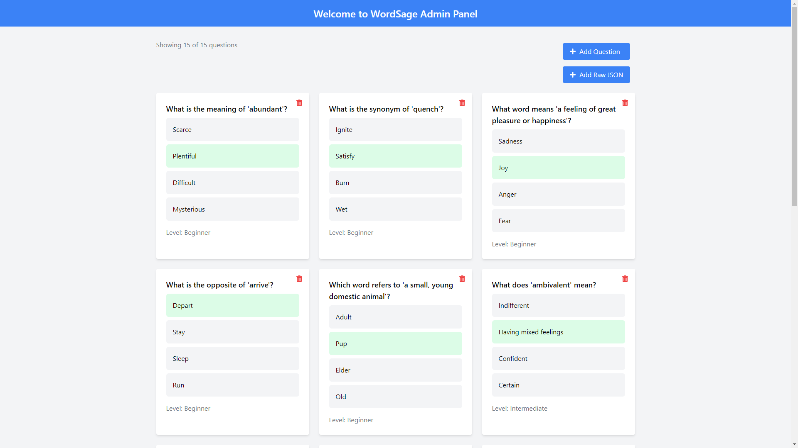

<div style="text-align: center;">
  <h1>WordSage 📚📱</h1>
</div>


WordSage is a personalized English vocabulary learning app built with React Native and NestJS, designed to help users enhance their vocabulary in an engaging and effective way. The application covers over 1500 words, including their meanings, synonyms, antonyms, and example sentences. It also offers interactive quizzes to reinforce learning and track progress over time.


## 🚀 Features

- ✨ **Personalized Learning:**  WordSage customizes the learning experience based on each user's skill level and progress, ensuring efficient learning.
- 📘 **Vast Vocabulary:** Access a comprehensive database of words, including their meanings, synonyms, antonyms, and example sentences with voice pronunciations.
- 🧠 **Interactive Quizzes:** Engage in quizzes that are interactive, reinforcing your learning and allowing you to track your progress over time.
- 👤 **User Profiles:** Create user profiles to monitor your learning journey.
- 🖥️ **Admin Panel:** The intuitive admin panel, built with React, enables easy management of app content and user data.
- 📱 **Cross-Platform:** The app is built with React Native, allowing it to run on both Android and iOS devices.

## 🛠️ Tech Stack

- ⚛️ **Frontend:** React Native
- 🧱 **Backend:** NestJS
- 💾 **Database:** MongoDB
- 🎨 **Admin Panel:** React, Vite, and Tailwind CSS

## ⚙️ Installation

### 📋 Prerequisites

- 📦 Node.js (Developed with v16)
- 🗄️ MongoDB or MongoDB Atlas
- 📱 Expo Go app (for Android)

> Note: Newer versions of Node.js may not be compatible with the dependencies used in the frontend. If you encounter any issues, consider using NVM to manage multiple versions of Node.js on your machine.

### 📝 Steps

1. **Clone the repository:**

   ```bash
   git clone https://github.com/nz-m/WordSage.git


2. **Install dependencies:**

Navigate to the project directory and run the following command in each of the directories: `frontend`, `backend`, and `admin-panel`

```bash
npm install
```

3. **Create `.env` files:**
   Create .env files in the `backend` and `admin-panel` directories following the format in the `.env.example` file.
4. **Setup backend URL in frontend:**
   In the `frontend` directory, locate the `baseUrl.js` file in the `constants` folder and change the value of the `API_BASE_URL` variable to the URL of the backend server.

5. **Start the backend server:**
```bash
npm start
```
>Access `http://127.0.0.1:4000/docs` to view the API documentation.
6. **Start the admin panel**
```bash
npm start
```
7. **Access the admin panel at `http://127.0.0.1:5173/` and add learning contents:**
> Note: You will find instructions on how to add content in the admin panel itself. The learning 
> contents are stored in the `backend` directory in the `resources` folder with appropriate file names.

8. **Start the app (frontend):**
```bash
npm start
```
Scan the QR code using the Expo Go app to run the app on your mobile device.


## 📷 Screenshots

<div style="display: flex; flex-direction: row;">
  
  
</div>

<div style="display: flex; flex-direction: row;">
  
  
</div>

<div style="display: flex; flex-direction: row;">
  
  
</div>

<div style="display: flex; flex-direction: row;">
  
  
</div>

<div style="display: flex; flex-direction: row;">
  
</div>





## 🤝 Contributing

Contributions are welcome! Feel free to submit a Pull Request.

## 🧑‍💻 Authors

- [Neaz Mahmud](https://github.com/nz-m)
- [Hasibul Hasan Nirob](https://github.com/hasibulhasannirob)


## 📬 Feedback

If you have any feedback, please reach out to us at [neaz6160@gmail.com](mailto:neaz6160@gmail.com)

## 📄 License

This project is licensed under the [MIT License.](https://github.com/nz-m/WordSage/blob/main/LICENSE)


